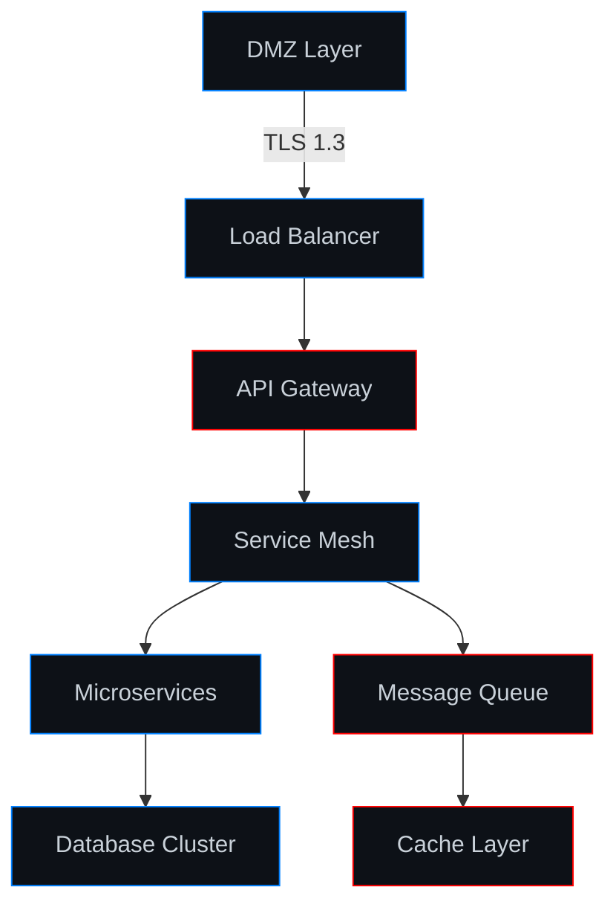

```
╔═══════════════════════════════════════════════════════════════════════════════════╗
║                                                                                   ║
║     ███████╗██╗██╗  ██╗ ██████╗ ██████╗ ███████╗██╗  ██╗██╗   ██╗██╗  ██╗██████╗ ║
║     ██╔════╝██║██║ ██╔╝██╔═══██╗██╔══██╗██╔════╝██║ ██╔╝╚██╗ ██╔╝██║  ██║╚════██╗║
║     ███████╗██║█████╔╝ ██║   ██║██████╔╝███████╗█████╔╝  ╚████╔╝ ███████║ █████╔╝║
║     ╚════██║██║██╔═██╗ ██║   ██║██╔══██╗╚════██║██╔═██╗   ╚██╔╝  ╚════██║ ╚═══██╗║
║     ███████║██║██║  ██╗╚██████╔╝██║  ██║███████║██║  ██╗   ██║        ██║██████╔╝║
║     ╚══════╝╚═╝╚═╝  ╚═╝ ╚═════╝ ╚═╝  ╚═╝╚══════╝╚═╝  ╚═╝   ╚═╝        ╚═╝╚═════╝ ║
║                                                                                   ║
║                         [ AUTONOMOUS OPERATION TERMINAL ]                        ║
║                                                                                   ║
╚═══════════════════════════════════════════════════════════════════════════════════╝
```

<div align="center">

```console
root@sikorsky:~# cat /proc/sys/kernel/hostname && uptime
sikorsky-mainframe
 03:47:21 up 1337 days, 13:37, load average: 0.00, 0.00, 0.00

root@sikorsky:~# netstat -tupln | grep ESTABLISHED | wc -l
47

root@sikorsky:~# iptables -L -n --line-numbers | grep DROP
Chain INPUT (policy DROP)
Chain FORWARD (policy DROP)

root@sikorsky:~# cat /etc/shadow | grep root
[REDACTED]

root@sikorsky:~# systemctl --failed
  UNIT LOAD ACTIVE SUB DESCRIPTION
0 loaded units listed.
```

</div>

---

## `# TECHNICAL STACK`

<div align="center">

**EXPLOITATION & DEVELOPMENT**
```
Python 3.11+ • C/C++ • Rust • Go • Assembly (x86_64/ARM)
```

**INFRASTRUCTURE & ORCHESTRATION**
```
Docker • Kubernetes • Terraform • Ansible • Prometheus
```

**NETWORK & SECURITY**
```
Wireshark • Nmap • Metasploit • Burp Suite • OWASP ZAP
tcpdump • iptables • OpenVPN • WireGuard
```

**DATABASE & CACHING**
```
PostgreSQL • Redis • MongoDB • ClickHouse • TimescaleDB
```

**SYSTEMS & KERNEL**
```
Linux Kernel Development • eBPF • SystemD • SELinux
QEMU/KVM • LXC • cgroups • namespaces
```

</div>

---

## `# OPERATIONAL METRICS`

<div align="center">


</div>

<div align="center">

```
┌─────────────────────────────────────────────────────────────────┐
│  COMMIT FREQUENCY ANALYSIS                                      │
├─────────────────────────────────────────────────────────────────┤
│  Mon  ████████░░  40 commits                                    │
│  Tue  ███████░░░  35 commits                                    │
│  Wed  █████████░  45 commits                                    │
│  Thu  ████████░░  40 commits                                    │
│  Fri  ██████░░░░  30 commits                                    │
│  Sat  ███░░░░░░░  15 commits                                    │
│  Sun  ██░░░░░░░░  10 commits                                    │
└─────────────────────────────────────────────────────────────────┘
```

</div>

---

## `# INFRASTRUCTURE TOPOLOGY`



---

## `# ACTIVE PROJECTS`

```python
#!/usr/bin/env python3
import asyncio
from dataclasses import dataclass
from typing import List, Optional

@dataclass
class Project:
    name: str
    stack: List[str]
    status: str
    
async def main():
    projects = [
        Project("distributed-filesystem", ["Rust", "FUSE"], "production"),
        Project("realtime-anomaly-detection", ["Python", "TensorFlow"], "active"),
        Project("custom-protocol-fuzzer", ["C++", "AFL++"], "research"),
        Project("kernel-rootkit-detection", ["C", "eBPF"], "development"),
    ]
    
    for project in projects:
        print(f"[{project.status.upper()}] {project.name}")
        print(f"  Stack: {', '.join(project.stack)}\n")

if __name__ == "__main__":
    asyncio.run(main())
```

---

## `# PACKET CAPTURE SAMPLE`

```
15:47:23.145267 IP 192.168.1.100.52341 > 203.0.113.50.443: Flags [S], seq 3284567891
15:47:23.167543 IP 203.0.113.50.443 > 192.168.1.100.52341: Flags [S.], seq 892456123, ack 3284567892
15:47:23.167621 IP 192.168.1.100.52341 > 203.0.113.50.443: Flags [.], ack 1
15:47:23.168234 IP 192.168.1.100.52341 > 203.0.113.50.443: Flags [P.], TLS 1.3 ClientHello
15:47:23.189765 IP 203.0.113.50.443 > 192.168.1.100.52341: Flags [.], TLS 1.3 ServerHello
15:47:23.234521 IP 192.168.1.100.52341 > 203.0.113.50.443: Flags [P.], len 1024 [encrypted]
```

---

## `# SYSTEM ARCHITECTURE`

```
┌─────────────────────────────────────────────────────────────────────────┐
│                          KERNEL SPACE                                   │
├─────────────────────────────────────────────────────────────────────────┤
│  ┌──────────────┐  ┌──────────────┐  ┌──────────────┐                  │
│  │   netfilter  │  │   eBPF/XDP   │  │   seccomp    │                  │
│  └──────────────┘  └──────────────┘  └──────────────┘                  │
│  ┌──────────────┐  ┌──────────────┐  ┌──────────────┐                  │
│  │  cgroups v2  │  │  namespaces  │  │  LSM hooks   │                  │
│  └──────────────┘  └──────────────┘  └──────────────┘                  │
├─────────────────────────────────────────────────────────────────────────┤
│                          USER SPACE                                     │
├─────────────────────────────────────────────────────────────────────────┤
│  ┌──────────────┐  ┌──────────────┐  ┌──────────────┐                  │
│  │   systemd    │  │   docker     │  │  journald    │                  │
│  └──────────────┘  └──────────────┘  └──────────────┘                  │
│  ┌──────────────┐  ┌──────────────┐  ┌──────────────┐                  │
│  │   custom     │  │   monitoring │  │   logging    │                  │
│  │   services   │  │   stack      │  │   pipeline   │                  │
│  └──────────────┘  └──────────────┘  └──────────────┘                  │
└─────────────────────────────────────────────────────────────────────────┘
```

---

## `# CRYPTOGRAPHIC OPERATIONS`

```c
#include <openssl/evp.h>
#include <openssl/aes.h>

typedef struct {
    uint8_t key[32];      // AES-256 key
    uint8_t iv[16];       // Initialization vector
    EVP_CIPHER_CTX *ctx;  // Cipher context
} crypto_state_t;

int encrypt_data(crypto_state_t *state, 
                 const uint8_t *plaintext, 
                 size_t len,
                 uint8_t *ciphertext) {
    int outlen;
    EVP_EncryptUpdate(state->ctx, ciphertext, &outlen, plaintext, len);
    return outlen;
}

// Secure key derivation using PBKDF2
void derive_key(const char *password, 
                const uint8_t *salt,
                uint8_t *key) {
    PKCS5_PBKDF2_HMAC(password, strlen(password),
                      salt, 16,
                      100000, EVP_sha256(),
                      32, key);
}
```

---

## `# NETWORK CONFIGURATION`

```yaml
# Kubernetes NetworkPolicy
apiVersion: networking.k8s.io/v1
kind: NetworkPolicy
metadata:
  name: deny-all-ingress
spec:
  podSelector: {}
  policyTypes:
  - Ingress
  - Egress
  ingress: []
  egress:
  - to:
    - namespaceSelector:
        matchLabels:
          name: kube-system
    ports:
    - protocol: TCP
      port: 53
    - protocol: UDP
      port: 53
```

---

## `# BINARY EXPLOITATION`

```asm
; x86_64 Assembly - ROP chain example
section .text
    global _start

_start:
    ; execve("/bin/sh", NULL, NULL)
    xor rax, rax
    push rax
    mov rbx, 0x68732f6e69622f  ; "/bin/sh"
    push rbx
    mov rdi, rsp
    xor rsi, rsi
    xor rdx, rdx
    mov al, 0x3b
    syscall
```

---

## `# MONITORING DASHBOARD`

```
┌─────────────────────────────────────────────────────────────────────────┐
│ CPU USAGE         ████████████████░░░░  80%                             │
│ MEMORY            ████████████░░░░░░░░  60%                             │
│ DISK I/O          ██████░░░░░░░░░░░░░░  30%                             │
│ NETWORK TX/RX     ████████████████████  95%                             │
├─────────────────────────────────────────────────────────────────────────┤
│ ACTIVE CONNECTIONS: 1,247                                               │
│ PACKETS/SEC:        45,678                                              │
│ UPTIME:             1337d 13h 37m                                       │
└─────────────────────────────────────────────────────────────────────────┘
```

---

## `# REVERSE ENGINEERING TOOLKIT`

```bash
# Static Analysis
radare2 -A ./binary
ghidra ./binary
objdump -d ./binary
strings ./binary | grep -i "password"

# Dynamic Analysis
strace -f ./binary
ltrace ./binary
gdb -q ./binary

# Binary Patching
xxd binary > binary.hex
# modify hex
xxd -r binary.hex > binary_patched

# Decompilation
retdec-decompiler --cleanup ./binary
```

---

## `# SECURE COMMUNICATION CHANNELS`

```
┌──────────────────────────────────────────────────────┐
│  PGP KEY FINGERPRINT                                 │
│  4096R/XXXXXXXX                                      │
│  Key fingerprint = XXXX XXXX XXXX XXXX XXXX         │
│                    XXXX XXXX XXXX XXXX XXXX         │
├──────────────────────────────────────────────────────┤
│  CONTACT VECTORS                                     │
│  ├─ Encrypted Email: pgp@protonmail.com             │
│  ├─ Matrix:          @sikorsky:matrix.org           │
│  ├─ Session ID:      [REDACTED]                     │
│  └─ Tor Hidden:      [REDACTED].onion               │
└──────────────────────────────────────────────────────┘
```

---

<div align="center">

```
╔════════════════════════════════════════════════════════════════════╗
║                                                                    ║
║  [✓] SECURE BOOT ENABLED                                          ║
║  [✓] FULL DISK ENCRYPTION (LUKS2 + AES-256-XTS)                   ║
║  [✓] KERNEL HARDENING (GCC Stack Protector + PIE)                 ║
║  [✓] NETWORK ISOLATION (VLAN + Firewall)                          ║
║  [✓] INTRUSION DETECTION (Suricata + Snort)                       ║
║  [✓] LOG AGGREGATION (ELK Stack)                                  ║
║                                                                    ║
╚════════════════════════════════════════════════════════════════════╝
```


**KERNEL:** `5.15.0-LTS` **ARCH:** `x86_64` **UPTIME:** `1337 days`

</div>

---

<div align="center">
<sub>All systems operational • Zero-trust architecture • Defense in depth</sub>
</div>
